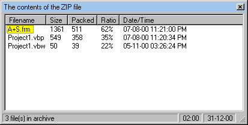



## Viewing the contents of a ZIP file, sans an OCX

### Description

This is largely based on the code authored by <a href="http://www.planet-source-code.com/xq/ASP/txtCodeId.9690/lngWId.1/qx/vb/scripts/ShowCode.htm">Richard Southey</a>, but it works w/o the OCX he used.
 
### More Info
 

             |
---                |---
**Submitted On**   |2000-12-31 02:01:50
**By**             |[Nenad Asanovic](https://github.com/Planet-Source-Code/PSCIndex/blob/master/ByAuthor/nenad-asanovic.md)
**Level**          |Intermediate
**User Rating**    |4.5 (27 globes from 6 users)
**Compatibility**  |VB 6\.0
**Category**       |[Miscellaneous](https://github.com/Planet-Source-Code/PSCIndex/blob/master/ByCategory/miscellaneous__1-1.md)
**World**          |[Visual Basic](https://github.com/Planet-Source-Code/PSCIndex/blob/master/ByWorld/visual-basic.md)
**Archive File**   |[CODE\_UPLOAD1319012302000\.zip](https://github.com/Planet-Source-Code/nenad-asanovic-viewing-the-contents-of-a-zip-file-sans-an-ocx__1-13965/archive/master.zip)

